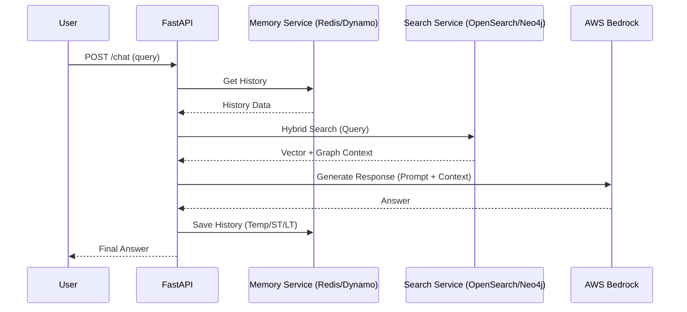

# API Documentation & Flow Logic

This document describes all the API endpoints available in the LLM Ops project, their purpose, and how they interact with the system components.

## 1. Chat API (`POST /api/v1/chat/`)
The primary endpoint for the RAG pipeline.

- **Purpose**: Processes user queries, retrieves context, and generates AI responses.
- **Workflow**:
    1.  **Context Fetching**: Calls `MemoryService` to retrieve recent conversation history from Redis (Temp) or DynamoDB (Short-term).
    2.  **Hybrid Search**: Calls `SearchService` to perform a dual search in OpenSearch (Vector) and Neo4j (Graph).
    3.  **Prompt Augmentation**: Combines the query, history, and search results into a structured prompt.
    4.  **LLM Call**: Sends the prompt to AWS Bedrock (Claude 3).
    5.  **Persistence**: Saves the interaction to Redis (8h), DynamoDB (7d), and S3 (Perpetual).
- **Request Body**:
    ```json
    {
      "query": "How do I scale ECS?",
      "user_id": "user_123",
      "session_id": "session_abc"
    }
    ```

## 2. Ingestion API (`POST /api/v1/ingest/`)
Handles the data pipeline for the RAG system.

- **Purpose**: Chunks documents, generates embeddings, and indexes them for search.
- **Workflow**:
    1.  **Chunking**: Splits input text into manageable sizes (e.g., 1000 characters).
    2.  **Embedding**: Calls `BedrockService` to generate vectors using the Titan model.
    3.  **Indexing**: Stores the text, embeddings, and metadata in OpenSearch.
- **Request Body**:
    ```json
    {
      "text": "Long document content...",
      "metadata": {"source": "manual", "version": "1.0"}
    }
    ```

## 3. Memory API (`GET /api/v1/memory/{user_id}`)
Retrieves historical interactions.

- **Purpose**: Allows users or admins to view the short-term memory stored in DynamoDB.
- **Workflow**: Queries the `UserChatHistory` DynamoDB table using the `user_id` as the partition key.

## 4. Cost API (`GET /api/v1/costs/`)
Monitors infrastructure and LLM spending.

- **Purpose**: Provides real-time visibility into AWS usage costs related to Bedrock and other services.
- **Workflow**: Uses the `CostController` to query AWS Cost Explorer for the current month's calculated spending.

## 5. Training API (`POST /api/v1/train/trigger`)
Triggers the MLOps fine-tuning pipeline.

- **Purpose**: Initiates a Bedrock customization job using data accumulated in S3.
- **Workflow**:
    1.  Scans S3 for chat logs.
    2.  Formats data into a JSONL training set.
    3.  Calls the Bedrock API to start a custom model training task.

## 6. Health API (`GET /health`)
System monitoring.

- **Purpose**: Used by ECS Load Balancers to verify the service is running and healthy.
- **Workflow**: Returns a simple JSON status and the current environment name.

---

## Technical Flow Diagram


