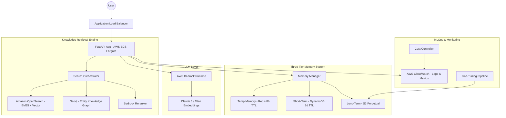

# System Architecture & Technical Deep Dive

This document provides a detailed breakdown of the technical components and workflows within the LLM Ops project.

## 1. High-Level Architecture

The system is designed as a modular, scalable Micro-RAG service deployed on AWS.

## 2. End-to-End Workflows

### 2.1 Query Processing Workflow (RAG)
1.  **Request Reception**: FastAPI receives the user query and session metadata.
2.  **Context Loading**: The Memory Manager fetches the last few turns from **Redis** (if available) or **DynamoDB**.
3.  **Hybrid Retrieval**:
    - **Vector Search**: OpenSearch retrieves semantically relevant chunks.
    - **Graph Search**: Neo4j identifies entity relationships (e.g., "Company X" -> "Acquired" -> "Company Y").
4.  **Reranking**: AWS Bedrock re-scores the combined results to select the top 5 most relevant context pieces.
5.  **LLM Generation**: The prompt is augmented with context and sent to **Claude 3**.
6.  **Response & Archival**: The response is returned to the user and asynchronously saved to the three-tier memory.

### 2.2 Data Ingestion & Indexing
1.  **Preprocessing**: Documents are cleaned and chunked using semantic splitting.
2.  **Embedding**: Titan model generates vector representations of chunks.
3.  **Indexing**: 
    - Chunks are stored in **OpenSearch**.
    - Entities/Relations are extracted and updated in **Neo4j**.

### 2.3 ML Lifecycle (Fine-tuning)
1.  **Data Accumulation**: User interactions are perpetually stored in **S3**.
2.  **Dataset Preparation**: A scheduled job (`fine_tuning_pipeline.py`) formats S3 JSON logs into JSONL files.
3.  **Training**: Triggers a **Bedrock Customization Job** to create a specialized model version.

## 3. Infrastructure & Automation
- **IaC**: Terraform manages the entire stack from VPC to OpenSearch.
- **CI/CD**: GitHub Actions handles unit testing, Docker image creation, and ECS rolling updates.
- **Stability**: Automated rollback triggers if the `/health` endpoint fails after a deployment.
