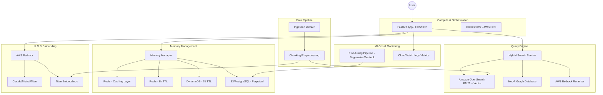

# System Design: End-to-End RAG LLM Ops Pipeline

## 1. Overview
This document outlines the architecture for a robust LLM Ops project featuring an end-to-end RAG pipeline using AWS Bedrock, managed via FastAPI with an MVC architecture, and deployed on ECS.

## 2. Architecture Diagram

## 3. Component Details

### 3.1 Backend Architecture
- **Framework**: FastAPI
- **Design Pattern**: Model-View-Controller (MVC)
  - **Models**: Defines data schemas for OpenSearch, Neo4j, and Memory entities.
  - **Services**: Business logic for RAG, Search, and Memory coordination.
  - **Controllers (Routes)**: API endpoints for chat, ingestion, and management.

### 3.2 Hybrid Vector Search
- **OpenSearch**: Handles keyword search (BM25) and vector search for semantic similarity.
- **Neo4j**: Provides knowledge graph context to enhance retrieval for complex entity relationships.
- **Reranker**: Uses AWS Bedrock's reranking capabilities to filter the top-k results from combined search sources.

### 3.3 Memory Management
| Memory Type | Duration | Storage | Purpose |
| :--- | :--- | :--- | :--- |
| **Temp** | 8 Hours | Redis | Active user session state. |
| **Short-term** | 7 Days | DynamoDB | Recent context for multi-turn conversations. |
| **Long-term** | Perpetual | S3 / RDS | Archival, audit logs, and fine-tuning data source. |
| **Cache** | N/A | Redis | Caching popular query responses to reduce LLM calls. |

### 3.4 DevOps & Infrastructure
- **Deployment**: ECS (Elastic Container Service) running on EC2 instances.
- **CI/CD**: GitHub Actions or AWS CodePipeline for building Docker images and deploying to ECS.
- **Monitoring**: AWS CloudWatch for log aggregation and metric tracking (latency, token usage, cost).
- **Cost Control**: Budget alerts and per-user token tracking logic.

## 4. Scalability & Performance
- Horizontal scaling with ECS.
- Hybrid search allows for precise and semantically rich retrieval.
- Multi-tier memory ensures efficient context management without over-burdening the LLM context window.

## 5. Security
- AWS IAM for service-to-service authentication.
- VPC isolation for OpenSearch and Neo4j.
- Encryption at rest and in transit.
